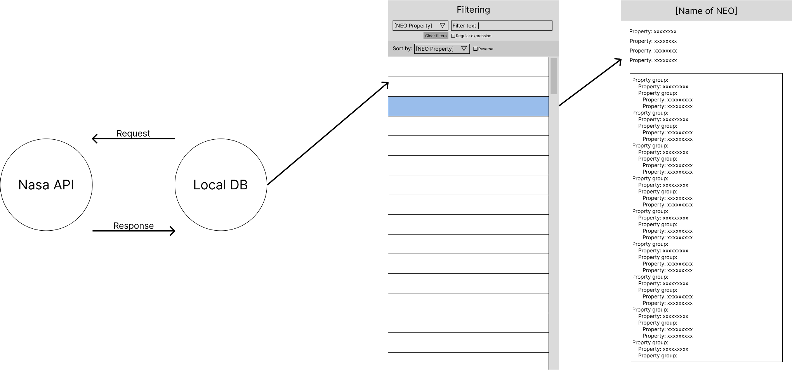

# Function specifications

## 1. Introduction 
### 1.1 Purpose
This app's purpose is to view data about any NEO
### 1.2 Document Conventions

### 1.3 Intended Audience and Reading Suggestions
This document is intended for developers, users and testers.
### 1.4 Other documents
[SRS](srs.md)

## 2. Scenarios
### 2.1 App usage
This project's goal is to give user a covninient way to select a perticular NEO and view all its available data - dimensions, orbit definition...
### 2.2 User roles
The app doesn't need any users nor their types
### 2.3 Detaily, motivace, příklady
App's goal is to download data about known NEOs from nasa's API, if internet is available, display them to the user in a list and provide a filtering system for convinient NEO selection. After selection, user will be able to display basic data in a user friendly way and also display all known data in a less user friendly way. If the internet isn't available, app will be able to access last loaded NEO data and use them.
### 2.4 Scope of the app:
App will:
  * Be able to list all available NEOs from nasa's API
  * Provide a filtering system for sorting through all the NEOs by their properties
  * Provide a way for user to select a specific NEO and display its properties:
    * User friendly GUI displaying basic data about the NEO
    * Less user friendly way for showing all the NEO's properties
  * Offline mode, which will load last downloaded NEO list

Emphasis won't be placed on:
  * App design
  * Code optimalization
  * Speed
  * Filter / display history
  
## 3. Rough architecture
### 3.1 Workflow
User will start by selecting a specific neo by filtering, then the user can inspect a selected NEO. After user is done inspecting, he can return to selecting. 
### 3.2 View details

The app will have two views:
1. NEO selection:
  * Top part - filtering
  * Rest of the view - list of NEOs, that satisfy the filter conditions
2. NEO inspection:
  * Top half - User friendly displaying of basic information
  * Rest of the view (scrollable) - A text field which will contain all of the NEO's properties formatted for the user
